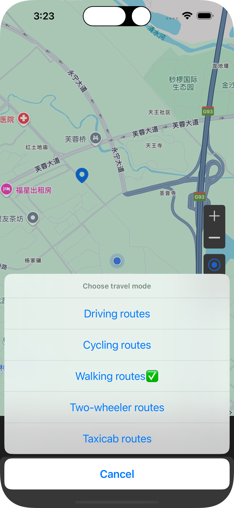

# CodingTest

## 程序摘要

1. App 采用 MVVM + RXSwift架构模式，界面布局采用 SnipKit 

2. 采用XCode Package管理第三方SDK，以下是引用的SDK

* GoogleMaps 地图
* GoogleNavigation 地图导航
* RxSwift    响应式编程
* SnapKit    界面布局
* swift-gen  自动生成资源文件代码
* swift-log  日志记录
* Toast      toast提示
* Reachability  网络监听

3. 目录说明

* Common: 配置Appkey文件及swift-gen自动生成文件
* Extensions：扩展文件夹
* Module：功能模块文件夹
* Utils：常用工具文件夹

## 开发应用程序的步骤

* 仔细阅读开发需求，整理出自己理解到的需求点并思考用什么方式实现
* 阅读Google地图开发文档，SDK相关配置及功能，找到满足需求开发的SDK的方法
* 阅读SDK，Demo代码，并尝试相关功能是否正常，是否符合需求
* 在尝试中遇到了不少问题，分析问题并解决问题（如 AppKey的权限问题，自己操作AppKey申请流程配置相关 `GoogleNavigation`权限 ）
* 在熟悉完SDK的Demo代码，思考自己CodingTest代码架构
* 按照Google地图开发文档，引入相关SDK
* 优先开发页面布局，整体界面UI完成60%左右，接入SDK功能
* 优先简单功能实现，自己拿不准的延期，后期通过阅读文档依次逐个解决
* 在开发过程中通过日志记录，分析代码问题、定位问题，解决问题
* 功能调试中不断地优化代码，检查是否完善所有功能，用户体验是否友好，是否存在异常
* 线下实际测试导航功能，并优化测试中发现的问题
* 再多部手机同时验证问题，是否存在差异性

## 应用程序的视频与截图

<video src="Screenshots/video.mp4" autoplay="true" controls="controls" width="400" height="300">
</video>

